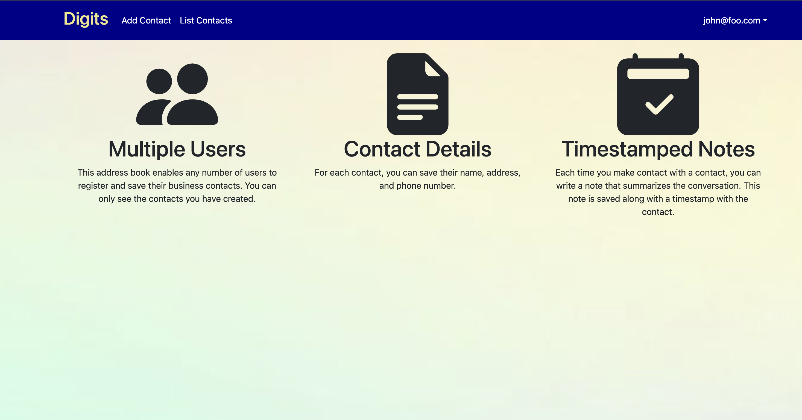
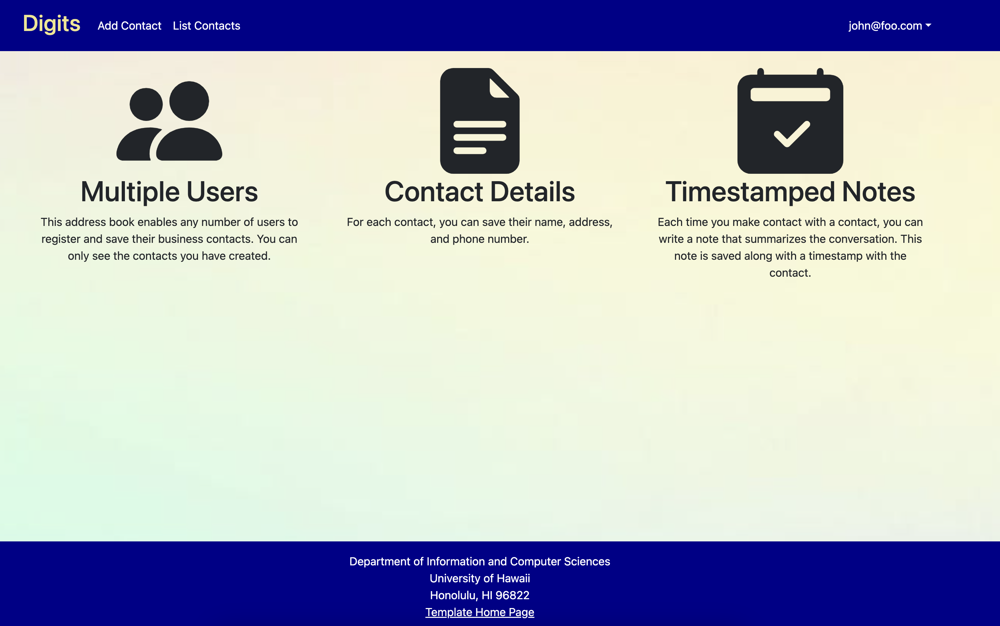
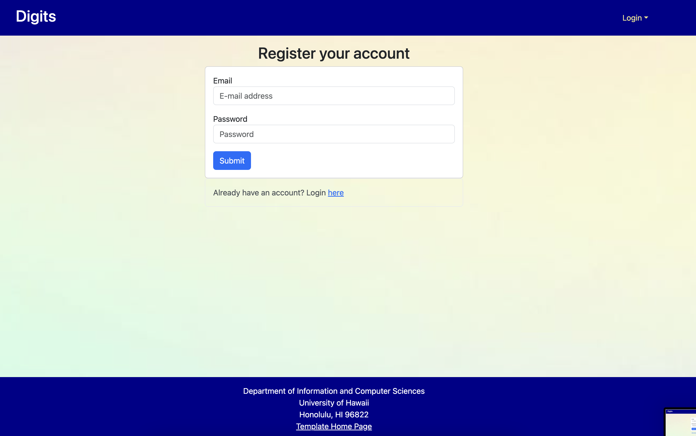
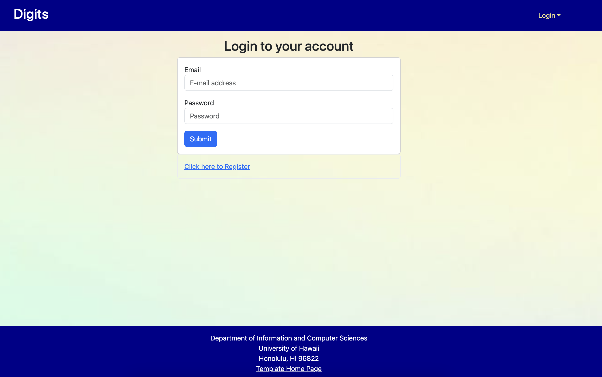
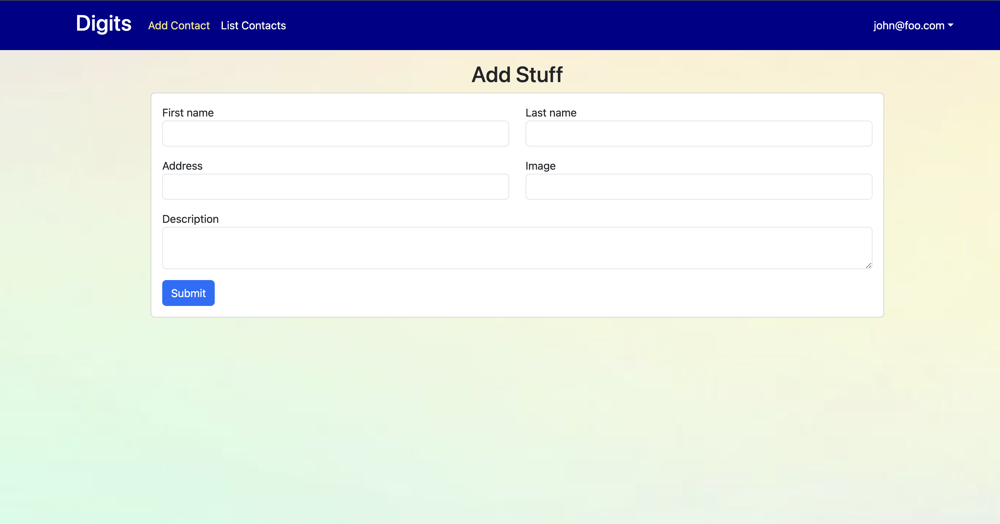
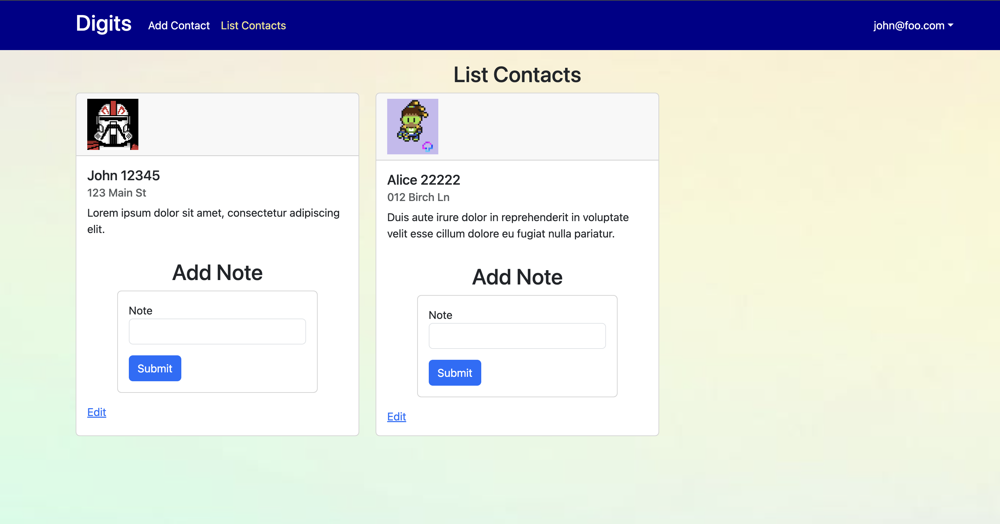
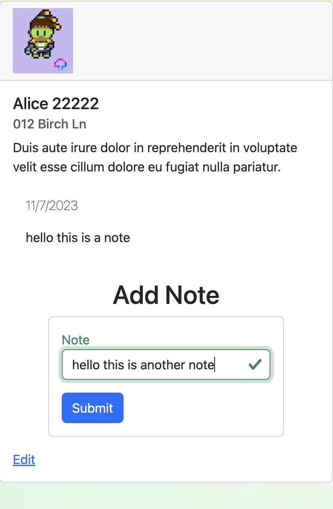
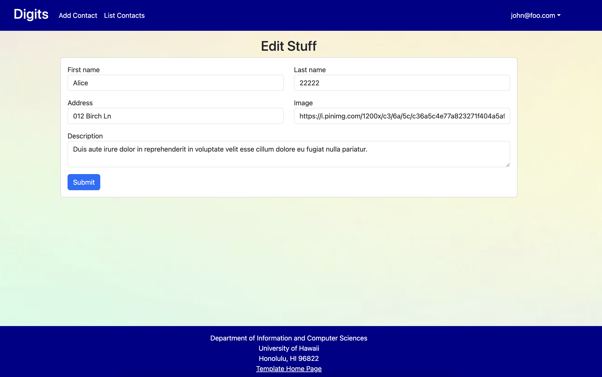
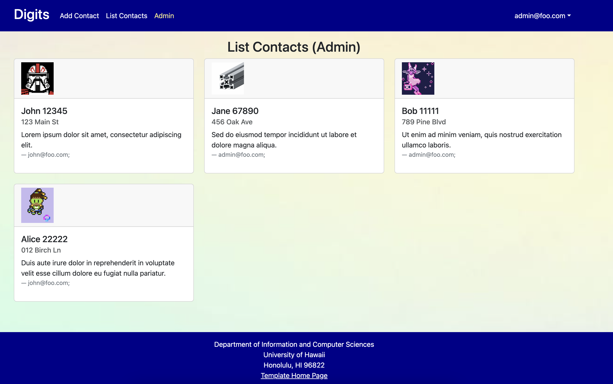

# Digits Web Application

### Installation 

1. Install [Meteor](https://docs.meteor.com/install.html)
2. Download [Digits](https://github.com/connorn-dev/digits)
3. cd into app directory and enter the command "meteor npm install" (to install required dependencies)
4. Start the application with "meteor npm run start"
5. Ignore bcrypt warning and other warnings
6. Once you see the text "=> App running at: http://localhost:3000/" you can visit the local host and view the page

## Walkthrough

### Home Page
The "Home Page" offers a brief summary of the abilities of the digits web application.

### Register Account
The "Register Account" let's users create an account for the web application. It is the first step users
should take when getting started.

### Login to Account
After users have registered an account they should sign in on the "/signin" page.

### Add Contacts

The "Add Contacts" page found at the top in the navbar allows users to add different contacts specific
to the currently signed in user.

### List Contacts

The "List Contacts" page found at the top in the navbar displays all the contacts that have been added
for the current user that is signed in.

### Add Note

The "Add Note" component can be found in the card of each contact. Allowing multiple contact specific notes to be added for every contact.

### Edit Contact

The "Edit Contact" page can be found below every contact. It allows the information about the contact to be changed.

### Admin Page

The "Admin" Page is only availible for accounts market with admin account type. The page displays all the contacts in the database and the account that created and "owns" them. 

Thank you for considering to use Digits web application. Have a good day!

